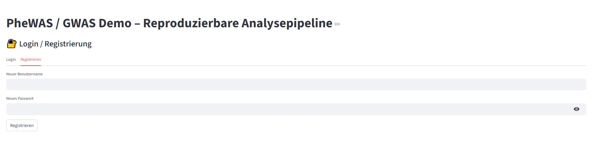
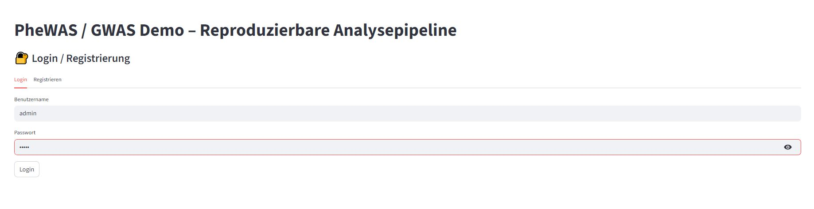
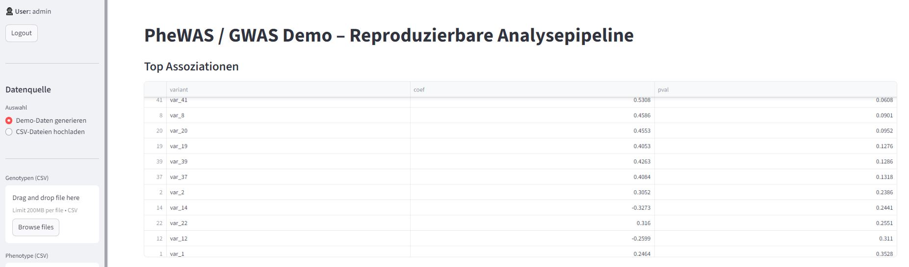
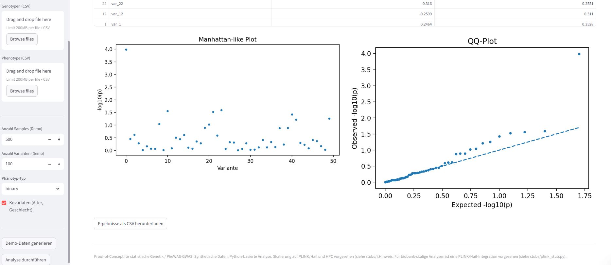

# PheWAS / GWAS Demo

Reproducible Statistical Genetics Prototype (Python · Streamlit · Nextflow · HPC)
----------------
Overview

This repository contains a reproducible proof-of-concept for statistical genetics and phenome-wide association studies (PheWAS/GWAS), developed as a technical demonstration for PhD-level research in biomedical informatics, statistical genetics, and machine learning.

The project focuses on correctness, reproducibility, and scalability-aware design, rather than raw data size. It combines an interactive Streamlit application for exploratory analysis and teaching with a batch-oriented Nextflow + SLURM workflow suitable for high-performance computing (HPC) environments.

All analyses are performed on synthetic data only.

----------------------------------
Key Features

Per-variant association testing (logistic and linear regression)

Phenotype and covariate handling (age, sex)

PheWAS/GWAS-style result inspection

Manhattan-like and QQ plots for quality control

Reproducible Python analysis (NumPy, Pandas, statsmodels)

Interactive Streamlit UI with user authentication (demo purpose)

Batch execution via Nextflow (DSL2)

SLURM-ready workflow configuration

Explicit PLINK and Hail integration stubs for biobank-scale analysis

Project structure
---------------------------------
```
├── app.py                     # Streamlit application
├── src/
│   ├── assoc.py               # Association testing logic
│   └── generate_data.py       # Synthetic genotype/phenotype generator
├── stubs/
│   ├── plink_stub.py          # PLINK GWAS integration (stub)
│   └── hail_stub.py           # Hail / Spark GWAS integration (stub)
├── workflows/
│   ├── nextflow/
│   │   ├── main.nf
│   │   ├── nextflow.config
│   │   └── modules/
│   │       └── gwas_python.nf
│   └── slurm/
│       └── submit.sh
├── data/                      # Synthetic demo data
├── results/                   # Analysis outputs
└── README.md
```

Local Run
---------------------
The Streamlit app (app.py) provides an interactive environment for:

Generating synthetic genotype and phenotype data

Uploading user-provided CSV files

Running per-variant association tests

Inspecting results via tables and diagnostic plots

Downloading results for downstream analysis

Requirements
---------------------
```
streamlit
pandas
numpy
matplotlib
scipy
```

Run Locally
---------------------
```
pip install -r requirements.txt
streamlit run app.py

```

Nextflow + SLURM Workflow
---------------------

To support reproducible batch execution and HPC scaling, the repository includes a minimal Nextflow DSL2 pipeline.

Run Locally
---------------------
```
cd workflows/nextflow
nextflow run main.nf -profile local


```

Run on SLURM
---------------------
```
nextflow run main.nf -profile slurm
```
The workflow reuses the same Python association logic as the Streamlit app, ensuring consistency between exploratory and batch analyses.

PLINK Integration (Stub)
---------------------

For biobank-scale GWAS, Python-based per-variant testing is not sufficient.
The file stubs/plink_stub.py documents how genotype and phenotype data would be handed off to PLINK for large-scale association testing (e.g. logistic regression).

The stub prints the exact PLINK command that would be executed on an HPC cluster but does not require real genotype data.

Hail Integration (Stub)
---------------------

For very large cohorts (100k+ samples), the project is designed to migrate to Hail (Spark-based).
The file stubs/hail_stub.py documents the intended Hail workflow using MatrixTables and logistic regression, without requiring Spark or real genomic data.

The application includes a minimal login/registration system implemented using Streamlit session state and password hashing. This is intended purely as a demonstration of access control concepts and is not a production authentication system.
Hinweis

-----
Outputs

<p align="center"></p>
<p align="center"></p>
<p align="center"></p>
<p align="center"></p>


**Author:** Shine Jose
**License:** MIT (see LICENSE file)

This repository is provided as sample educational content by Shine Jose..... Use and modify freely.........
